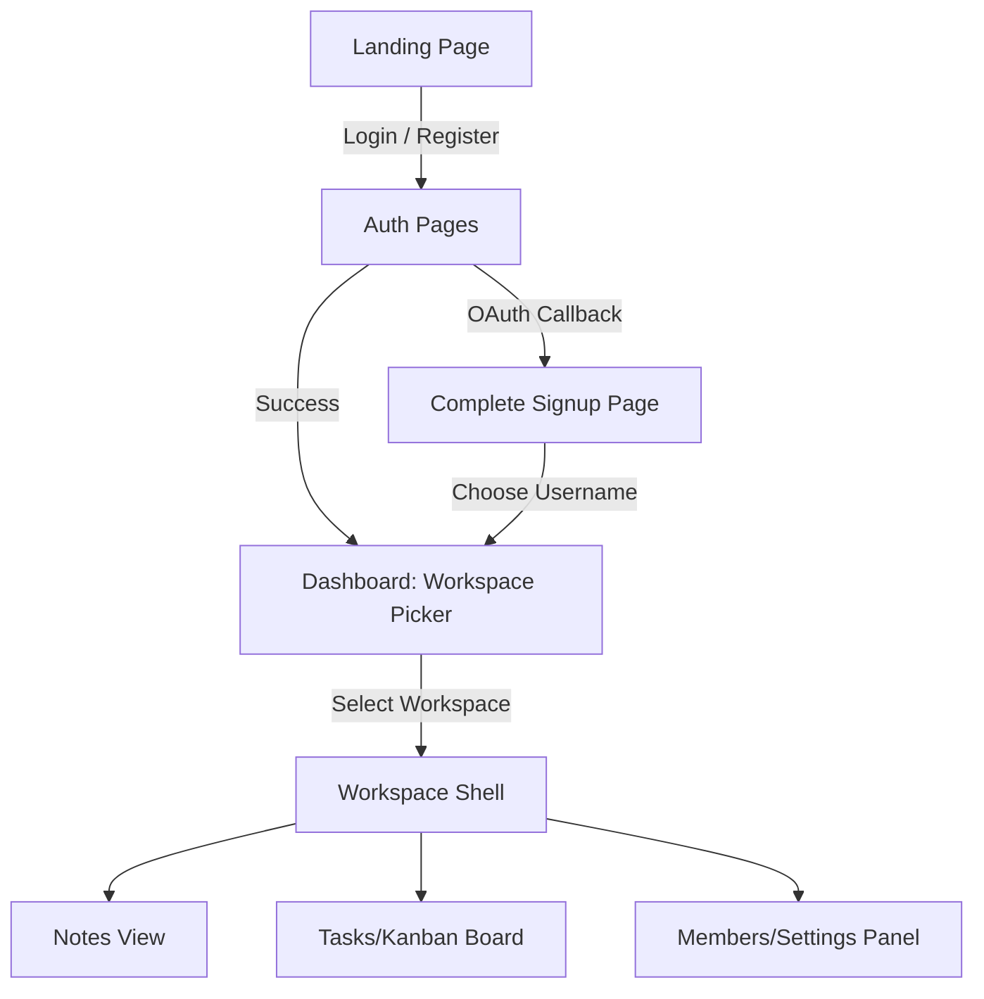
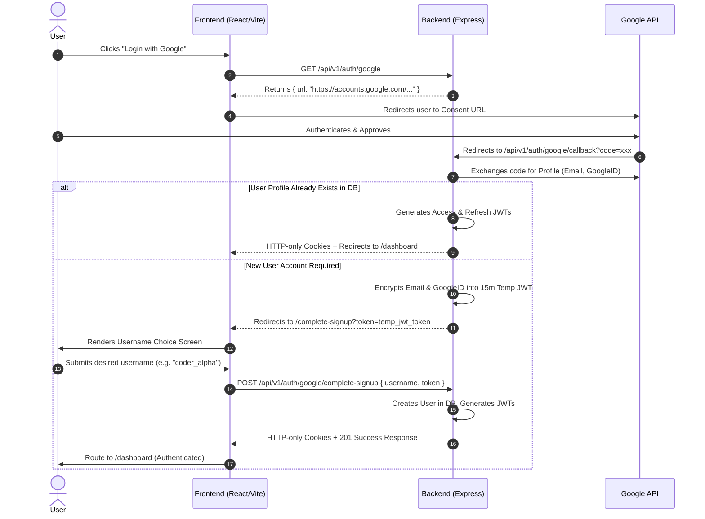
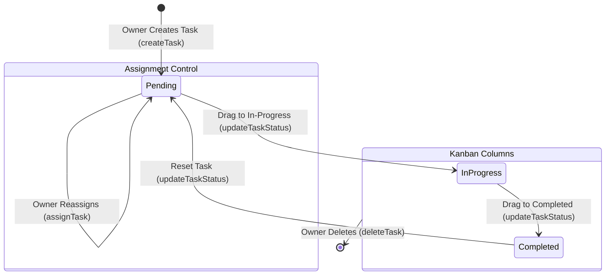

# NotesFlow: Product Requirement Document (PRD) & System Workflow

NotesFlow is a collaborative workspace management web application that combines workspace organization, task tracking (Kanban-style), and persistent document/note-taking. 

This document serves as a comprehensive Product Requirement Document (PRD) and details the end-to-end user workflows, showing how a modern Frontend matches the current Express + MongoDB backend.

---

## 1. Executive Product Summary

NotesFlow solves the problem of scattered team management by placing **Workspaces** at the absolute core. Within a single workspace, users can securely share documents (Notes) and assign/manage action items (Tasks).

### Target Audience
* Small-to-medium teams looking for a combined Notion + Trello-like experience.
* Individual developers/students managing multiple client projects or courses.

---

## 2. Core Frontend Views & Layout Architecture

To support the current backend endpoints, the Frontend requires 5 main views:

### A. Authentication Suite (`/login` & `/register`)
* **Standard Email/Password**: Secure form validation using the backend's email, username, and password requirements.
* **Google OAuth Button**: Initiates external authentication flow redirecting the user to the Google Consent screen.

### B. Complete Signup View (`/complete-signup?token=...`)
* **Purpose**: Captures a custom, unique username for users signing up with Google OAuth for the first time.
* **Mechanics**: Captures a token parameter from the URL query, asks the user for a username, validates it against lowercase constraints, and posts it to the backend to establish the permanent account.

### C. Primary Dashboard (`/dashboard`)
* **Workspace Picker**: Lists all workspaces the user owns or belongs to (`GET /api/v1/workspaces/`).
* **Search / Create**: Quick interface to find workspaces (`GET /api/v1/workspaces/search?query=...`) or initialize a new one with a name modal (`POST /api/v1/workspaces/`).

### D. Workspace Workspace Shell (`/workspace/:workspaceId`)
A sidebar navigation interface splitting the workspace into three tabs:
1. **Notes Space**: Grid view of notes with full-text search and a rich markdown creator.
2. **Task Board**: A columned Kanban layout tracking task statuses (`pending`, `in progress`, `completed`).
3. **Workspace Settings/Members**: List members, invite others via their user IDs, or leave/delete the workspace.

---

## 3. End-to-End User Journeys (Frontend ➔ Backend Workflow)

### 🔑 Workflow 1: The Google OAuth Signup & Onboarding
This flow shows the unique split login/signup logic implemented in the backend:

---

### 💼 Workflow 2: Workspace Setup & Member Management
This workflow details the collaborative setup of a team room:

1. **Creating the Workspace**:
   * User enters a name (e.g. `"Alpha Project Team"`) on the Frontend modal.
   * Frontend validates length $\ge 3$ characters and issues `POST /api/v1/workspaces/` with `{ name }`.
   * Backend creates the document, setting the user as both `owner` and first member of the `members` list.
2. **Adding Members**:
   * Workspace owner enters another user's MongoDB ID.
   * Frontend triggers `PATCH /api/v1/workspaces/:workspaceId/add` with `{ memberId }`.
   * Backend validates that the current user is the owner, checks if the target member is already joined, and adds them.
3. **Leaving / Deleting**:
   * Non-owners can click "Leave Workspace" -> `PATCH /api/v1/workspaces/:workspaceId/leave`.
   * Owners can click "Delete Workspace" -> `DELETE /api/v1/workspaces/:workspaceId`.

---

### 📝 Workflow 3: Document Management (Notes)
How users create, query, and modify records in their workspace:

* **Fetching Workspace Notes**:
  * Upon mounting the Workspace Notes page, the Frontend issues `GET /api/v1/notes/:workspaceId?page=1&limit=10`.
  * The backend returns a list of notes matching that workspace.
* **Creating a Note**:
  * User clicks "New Note", enters a Title and Content.
  * Frontend sends `POST /api/v1/notes/:workspaceId` with `{ title, content }`.
  * Backend attaches `createdBy: req.user._id` and saves it.
* **Editing in Real-Time**:
  * As the user types in the rich text area, the Frontend triggers a debounced (e.g., 500ms delay) `PATCH /api/v1/notes/:noteId` with `{ title, content }` to auto-save edits.
* **Searching Documents**:
  * User types in a global search box.
  * Frontend triggers `GET /api/v1/notes/:workspaceId/search?query=term`.
  * Backend returns regex-matched titles in that workspace.

---

### 📋 Workflow 4: Task Tracker (Kanban Board)
Interactive workflow managing collaborative tasks:

1. **Creating & Assigning**:
   * Workspace owner clicks "Create Task".
   * Frontend presents a form containing:
     * Task Title
     * Assignee Dropdown (populated with usernames from the workspace's members list).
   * User submits -> Frontend posts `POST /api/v1/tasks/:workspaceId` with `{ title, assignedTo }`.
2. **Viewing Assigned Tasks**:
   * When loading the taskboard, the workspace triggers `GET /api/v1/tasks/:workspaceId`.
   * Backend returns the tasks matching that workspace **that are specifically assigned to the logged-in user** (`assignedTo: req.user._id`).
3. **Transitioning Status**:
   * User drags a task from the "Pending" column to the "In Progress" column.
   * Frontend triggers a status change `PATCH /api/v1/tasks/:taskId/status` with `{ status: "in-progress" }`.
   * Backend verifies the current user is indeed the assignee, updates the status, and saves.

---

## 4. Architectural & Integration Recommendations

To ensure absolute stability, security, and top-tier user experience during frontend implementation:

### 🔐 Security & Cookies
* Use `axios` or standard `fetch` with `credentials: 'include'` (in Axios: `withCredentials: true`) to ensure that HTTP-only cookies (`accessToken` and `refreshToken`) are automatically transmitted in every API cycle.
* Intercept `401 Unauthorized` responses: Setup an Axios interceptor that catches expired access tokens, calls `POST /api/v1/auth/refresh-token` in the background to transparently renew cookies, and re-runs the initial user request without interface interruption.

### ⚡ State Management Recommendations
* Use **Zustand** or **Redux Toolkit** to manage workspace state globally.
* Split your global store into slices:
  * `authSlice`: Logged-in user information, session state, and loading states.
  * `workspaceSlice`: Currently selected workspace ID, metadata, and member listings.
  * `notesSlice` & `tasksSlice`: Lists, filters, pagination parameters, and temporary editor buffers.
